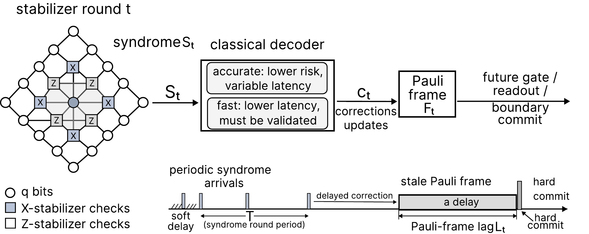

# RT-PreQEC — Reproduction Artifact

**RT-PreQEC: Lag-Bounded Real-Time Scheduling for Quantum Error Correction** (RTSS 2026).

This repository is the self-contained reproduction artifact. It holds the runtime,
the evaluation harness, every committed run input, the trained models, the published
figures, and the data behind every figure and table in the paper. Nothing here
references files outside this directory.



Each stabilizer round produces a syndrome that the classical control system must
decode fast enough to keep the Pauli frame current; a decoding backlog delays
corrections and degrades later logical operations. RT-PreQEC is the real-time layer
in that loop: it dispatches a continuous syndrome stream across a fast lookup
decoder and an accurate PyMatching decoder under deadline, backlog, and
Pauli-frame-lag constraints, using a front-end certificate and a learned LSTM risk
estimate to decide what may commit through the fast path.

---

## Quick start (≈ 5 minutes)

From a fresh clone, four commands reproduce the paper's numbers and figures from the
committed traces:

```bash
# 1. Create the environment and install the package
conda env create -f environment.yml && conda activate rt-preqec
python -m pip install -e .[dev]

# 2. Check every reported metric against the committed traces (364 checks)
python scripts/verify_paper_numbers.py

# 3. Redraw the data figures (Fig. 5-8) as PNG + PDF
python scripts/make_rtss_plots.py \
    --run-dir table/figure_data/d7_main \
    --threshold-sweep table/figure_data/threshold_sweep/threshold_sweep.csv \
    --burst-run-dir table/figure_data/burst \
    --format both --out results/figures/rerun

# 4. Rebuild the table CSVs (the data behind t1.png and Fig. 9)
python scripts/export_rtss_tables.py --run-dir table/figure_data/d7_main \
    --out results/tables/rerun
```

Step 2 prints `364 metric checks reproduce, 0 deviate (rtol=1e-06)`. Steps 3–4 replay
the committed traces in `table/figure_data/`, so the outputs match the paper exactly
without running any experiment. Figures land in `results/figures/rerun/`, tables in
`results/tables/rerun/`; compare them against the committed references under
`figure/`, `results/figures/`, and `table/`.

> The full stack (including `torch`) is required even for steps 2–4, because the
> queue simulator and evaluators import it. There is no reduced install.

---

## One-command full reproduction

To re-run every experiment end-to-end (not just replay the traces) and then re-render
all figures and tables from the fresh runs:

```bash
bash scripts/run_all_experiments.sh
```

This runs the four regimes (main d=7, scaling d=11, burst 1-worker + 2-worker, and the
decoupled threshold sweep), measures the component overheads, then rebuilds every
figure and table from those runs. **~25 minutes** on a single core; per-step logs are
written to `results/logs/`. Set `RUN=0` to skip the runs and only re-render from the
committed traces.

The individual pieces are described below if you want to run them one at a time.

---

## Experiments

`scripts/run_paper_experiment_suite.py` is the single entry point: one invocation runs
one regime over all 13 modes on the committed traces (paired-shot protocol). All
commands pass the committed learned-risk checkpoint `checkpoints/risk_lstm_v2_smoke_30.pt`
so the RT-PreQEC mode (`rt_qec_ai`) is exercised. **Do not add `--calibration`** — the
published runs read routing thresholds from the config, and the calibration sidecar
would override the scheduler threshold.

### Main regime (d = 7) — Fig. 5, Fig. 6, t1.png, Fig. 9   (~1.5 min)

```bash
python scripts/run_paper_experiment_suite.py \
    --config configs/real_stream_eval_main_ai_selected.yaml \
    --records table/figure_data/d7_main/records.csv --split test \
    --risk-checkpoint checkpoints/risk_lstm_v2_smoke_30.pt \
    --include-ai --no-threshold-sweep \
    --out results/runs/paper_suite_d7_rtqec_ai_selected
```

`main/summary_metrics.csv` is the 13-mode table behind Figure 5, t1.png, and Figure 9;
`main/<mode>/events.csv` feeds the Figure 6 CDF.

### Scaling regime (d = 11) — regime-summary rows   (~10 min)

```bash
python scripts/run_paper_experiment_suite.py \
    --config configs/real_stream_eval_scaling.yaml \
    --records table/figure_data/d11_scaling/records.csv --split test \
    --risk-checkpoint checkpoints/risk_lstm_v2_smoke_30.pt \
    --include-ai --no-threshold-sweep \
    --out results/runs/paper_suite_d11_rtqec_ai
```

### Burst regime (d = 7, overload) — Fig. 7 + burst-capacity table   (~3 min)

```bash
# 1 worker (Figure 7)
python scripts/run_paper_experiment_suite.py \
    --config configs/real_stream_eval_burst.yaml \
    --records table/figure_data/burst/records.csv --split test \
    --risk-checkpoint checkpoints/risk_lstm_v2_smoke_30.pt \
    --include-ai --no-threshold-sweep \
    --out results/runs/paper_suite_burst_rtqec_ai

# 2 workers (sensitivity point)
python scripts/run_paper_experiment_suite.py \
    --config configs/real_stream_eval_burst_2w.yaml \
    --records table/figure_data/burst_2w/records.csv --split test \
    --risk-checkpoint checkpoints/risk_lstm_v2_smoke_30.pt \
    --include-ai --no-threshold-sweep \
    --out results/runs/paper_suite_burst_2w_rtqec_ai
```

### Decoupled threshold sweep — Fig. 8   (~9 min)

The sweep decouples the predecode shaping threshold from the scheduler fast-commit
threshold and runs on the validation split:

```bash
python scripts/run_paper_experiment_suite.py \
    --config configs/real_stream_eval_main_ai_selected.yaml \
    --split test --threshold-split val \
    --risk-checkpoint checkpoints/risk_lstm_v2_smoke_30.pt \
    --include-ai --threshold-sweep \
    --predecode-risk-thresholds 0.35 --confidence-thresholds 0.50 \
    --out results/runs/paper_suite_d7_rtqec_ai_decoupled
```

Writes `threshold_sweep.csv` at the run root — the Figure 8 source. (The committed
grid `table/figure_data/threshold_sweep/threshold_sweep.csv` is what Figure 8 plots.)

### Ablations

No separate command is needed: the main d=7 run already evaluates every mode on the
same shots, including all eight ablation variants (no validation, no abstention, no
scheduler, heuristic certified, front-end only, rule risk, learned risk only, EDF).
`scripts/export_rtss_tables.py` turns that one `summary_metrics.csv` into the
main-results table, the ablation table, and the per-ablation deltas behind Figure 9.

### Component overheads — `tab:overhead`   (~1 min)

An isolated microbenchmark of each runtime component (empirical timing, not a trace
product):

```bash
python scripts/measure_rtss_overheads.py \
    --config configs/real_stream_eval_main.yaml \
    --num-shots 2000 --warmup-shots 100 \
    --out results/runs/wcet_overheads_d7
```

`overhead_summary.csv` matches `table/rtss_overhead_table.csv` (means reproduce
closely; tails move with the machine, as expected for an empirical microbenchmark).

---

## Data

Everything needed is committed, so no data has to be regenerated to reproduce the
paper. Two kinds of inputs ship with the artifact:

- **Evaluation traces** — `table/figure_data/<regime>/` holds one committed trace per
  regime (`records.csv` plus `summary_metrics.csv` and per-mode `events.csv` for all
  13 modes). These are the exact syndrome batches the paper reports; the Quick-start
  and experiment commands above replay them, so the numbers come out identical. They
  were produced by `scripts/run_paper_experiment_suite.py` (Stim sampling → decode →
  queue simulation).
- **Trained models** — `checkpoints/` holds the LSTM risk profiler
  (`risk_lstm_v2_smoke_30.pt` + sidecars) and the front-end predecoder
  (`predecoder_v1_300k.pt`), and `data/processed/` holds the 300k-sample predecoder
  dataset (`predecoder_dataset_v1_300k.npz`).

Regenerating these from scratch is only needed to change the workload or retrain:

```bash
# 300k-sample predecoder dataset  ->  data/processed/  (Stim sampling, slow)
python scripts/build_predecoder_dataset.py            # writes data/processed/predecoder_dataset_v1_300k.npz

# risk-profiler dataset  ->  used to train the LSTM risk model
python scripts/build_risk_dataset.py --config configs/risk_profiler.yaml \
    --out data/processed/risk_dataset.npz

# retrain the two learned components
python scripts/train_predecoder.py    --config configs/train_predecoder.yaml \
    --data data/processed/predecoder_dataset_v1_300k.npz --out checkpoints/predecoder.pt
python scripts/train_risk_profiler.py --config configs/risk_lstm.yaml \
    --model-type risk_lstm --data data/processed/risk_dataset.npz --out checkpoints/risk_lstm.pt
```

These regeneration steps re-sample syndromes with Stim, so their output is not
bit-identical to the committed copies; the committed traces and checkpoints remain the
source of truth for the paper's numbers.

---

## Figures

The paper has ten figures. The four data figures are reproducible; the rest are
committed as published.

| Figure | Content | How to reproduce |
|---|---|---|
| **Fig. 1–4** | Control loop, task model, architecture, priority composition | Hand-drawn schematics; committed as `figure/figure1-4.pdf` |
| **Fig. 5** | Main operating-point comparison (`fig:pareto`) | `main_pareto_frontier` ← `d7_main/summary_metrics.csv` |
| **Fig. 6** | Response-time CDF (`fig:cdf`) | `response_time_cdf_by_mode` ← `d7_main/<mode>/events.csv` |
| **Fig. 7** | Burst lag & response over time (`fig:burst`) | `burst_lag_backlog_trace` ← `burst/<mode>/events.csv` |
| **Fig. 8** | Decoupled threshold sweep (`fig:sweep`) | `threshold_sweep_lag_frontier` ← `threshold_sweep.csv` |
| **Fig. 9** | Ablation impact vs. RT-PreQEC (`fig:ablation-delta`) | rendered from `rtss_ablation_delta_vs_rt_qec.csv` (step 4) |
| **t1.png** | Main results (`fig:main`) | rendered from `rtss_main_table.csv` (step 4) |

Figures 5–8 are produced by `scripts/make_rtss_plots.py` (Quick-start step 3). Pass
`--format pdf` for the paper-ready PDFs or `--format both` for PNG + PDF. To redraw
from a fresh run instead of the committed traces, point `--run-dir` /
`--burst-run-dir` / `--threshold-sweep` at the run's `main/` directory and
`threshold_sweep.csv`. Figures 9 and t1.png are plotted directly from their CSVs,
which step 4 regenerates byte-identically. The published PNG renderings of all ten
figures are in `docs/assets/` and `results/figures/`.

---

## Tables

| Table | Content | How to reproduce |
|---|---|---|
| `tab:overhead` | Per-component overhead | `scripts/measure_rtss_overheads.py` (see Experiments) |
| `tab:regimes`, `tab:modes` | Regime and mode configuration | Hand-written in the paper; see the Appendix below |
| `regime_summary_table.csv` | d7 / d11 / burst summary | `scripts/summarize_rtss_results.py` |
| `frontend_contract_table.csv` | Front-end accept / abstain / false-accept | `scripts/summarize_rtss_results.py` |
| `rtss_burst_capacity_table.csv` | 1-worker vs 2-worker burst | `scripts/export_rtss_tables.py --burst-1w-run-dir … --burst-2w-run-dir …` |

Regime summary and front-end contract tables (from fresh runs or committed traces):

```bash
python scripts/summarize_rtss_results.py \
    --d7    table/figure_data/d7_main/summary_metrics.csv \
    --d11   table/figure_data/d11_scaling/summary_metrics.csv \
    --burst table/figure_data/burst/summary_metrics.csv \
    --out-dir results/tables/rerun
```

---

## Repository layout

```text
.
├── README.md                  ← you are here
├── environment.yml            # conda environment (full stack)
├── pyproject.toml             # pip package + dev extras
├── configs/                   # all experiment configs
│   ├── real_stream_eval_main_ai_selected.yaml   # main regime, d=7 (paper operating point)
│   ├── real_stream_eval_scaling.yaml            # scaling regime, d=11
│   ├── real_stream_eval_burst{,_2w}.yaml        # burst regime, 1 / 2 workers
│   └── policies/runtime_guard_q95_d7.json       # hash-pinned runtime-guard margins
├── src/rt_preqec/             # the runtime, scheduler, front-end, evaluators, learned models
├── scripts/                   # reproduction entry points (see above)
│   └── run_all_experiments.sh # one-command full reproduction
├── tests/                     # pytest suite
├── figure/                    # the paper's ten figures as published (9 PDFs + t1.png)
├── table/                     # CSV data behind every figure and table
│   └── figure_data/           #   committed per-regime traces that regenerate Fig. 5-8
├── checkpoints/               # trained models (LSTM risk profiler, predecoder)
├── data/processed/            # committed 300k-sample predecoder dataset
├── docs/assets/               # PNG renderings of the paper figures (used by this README)
└── results/                   # figures/ tables/ runs/ logs/ — outputs land here
```

---

## Environment

The artifact is **CPU-first**; no GPU is required for any reproduction step. The
paper's numbers were produced on the reference machine, single thread, Python 3.10.
The logic behaves identically across machines, while absolute timing numbers shift
with the CPU. Machine specifications are listed under
[System requirements](#system-requirements) at the end of this file.

### Setup

- **Conda (recommended):** `conda env create -f environment.yml && conda activate rt-preqec`
- **pip:** `python -m pip install -e .[dev]` into any Python ≥ 3.10

`environment.yml` intentionally pins no versions. The exact set used for the published
numbers is recorded in each run's `suite_manifest.json`: Python 3.10.20, numpy 2.2.6,
pandas 2.3.3, torch 2.10.0, stim 1.16.0, pymatching 2.4.0, matplotlib 3.10.9. Install
these if you need the closest match on timing-derived metrics.

**Tests.** `python -m pytest tests -q` → **164 passed, 1 failed**. The single failure
(`tests/test_rtss_artifacts.py::test_export_rtss_tables_writes_expected_csvs`) is a
stale fixture whose mode list omits `rt_qec_ai`; it is unrelated to the runtime.

**Fallback flag.** If `stim`/`sinter`/`pymatching` is missing, the harness runs a toy
fallback and records `real_qec=false` in `metrics.json`. `real_qec=true` is required
for any paper claim.

---

## Appendix

### Paper name ↔ mode key

The paper uses descriptive names; the code uses mode keys (authoritative mapping in
`scripts/export_rtss_tables.py:MODE_LABELS`):

| Paper name | Mode key | Role |
|---|---|---|
| Accurate-only | `accurate_only` | endpoint |
| Fast-only | `fast_only` | endpoint |
| EDF | `edf` | timing-first baseline |
| **RT-PreQEC** | **`rt_qec_ai`** | main method (learned risk) |
| Heuristic certified | **`rt_qec`** | ablation (rule-based risk) |
| Front-end only | `heuristic_pre_fixed` | ablation |
| Rule risk | `risk_heuristic` | ablation |
| Learned risk only | `ai_risk` | ablation |
| No validation (A1) | `rt_qec_without_validation` | ablation |
| No abstention (A2) | `rt_qec_without_abstention` | ablation |
| No scheduler (A3) | `rt_qec_without_scheduler` | ablation |
| Oracle front-end | `oracle_predecoder` | upper bound (not deployable) |
| Oracle risk | `oracle_risk` | upper bound (not deployable) |

The `--include-ai` flag inserts `ai_risk` and `rt_qec_ai` into the mode list; without
it a run has 11 modes and no RT-PreQEC row.

### Regime configurations

Shared settings: rotated surface code, memory-X, 10 000 shots, test fraction 0.4, max
Pauli-frame lag 4, train seed 42, eval seed 1001, scheduler weights α=1.0 / β=1.2 /
γ=0.5 / δ=2.0, boundary drain 2.

| Regime | Config | d | rounds | p | period (µs) | deadline (µs) | workers |
|---|---|---:|---:|---:|---:|---:|---:|
| Main | `real_stream_eval_main.yaml` (+ `_ai_selected`) | 7 | 7 | 0.003 | 6 | 48 | 1 |
| Scaling | `real_stream_eval_scaling.yaml` | 11 | 11 | 0.003 | 10 | 40 | 1 |
| Burst | `real_stream_eval_burst.yaml` / `_2w` | 7 | 7 | 0.005 | 7 | 28 | 1 / 2 |

Selected d=7 operating point (`real_stream_eval_main_ai_selected.yaml`): front-end
confidence threshold 0.50, predecoder risk threshold 0.35, scheduler risk threshold
0.30, max cluster size 6.

### Reproducibility notes

- Reproduction **replays committed traces**; `verify_paper_numbers.py` reports 364
  checks reproduce at `rtol=1e-6`, and `export_rtss_tables.py` returns the five
  `table/rtss_*.csv` byte-identical.
- Component overheads are **empirical timing, not WCET** — tails shift between
  machines while trace-derived metrics do not.
- Within one run all modes decode the **same shots** (paired-shot protocol), so
  differences reflect routing/scheduling rather than noise realization.
- Figure 8's sweep runs on the validation split, which is not among the committed
  traces; the committed grid is what Figure 8 plots.

---

## System requirements

**Hardware.** CPU-only; no GPU or other accelerator is required for any reproduction
step. Any modern multi-core x86-64 processor with ≥ 8 GB RAM is sufficient — the full
pipeline (§ Experiments) peaks at a few GB. The workload is single-threaded by design.

**Operating system.** Windows 10+, Linux, or macOS (64-bit). The logic is
OS-independent; absolute timing numbers shift with the CPU.

**Software.** Python ≥ 3.10, with `numpy, scipy, pandas, pyyaml, tqdm, typer, rich,
matplotlib, scikit-learn, torch, stim, sinter, pymatching` (plus `pytest` for the test
suite). Install via `conda env create -f environment.yml` or `pip install -e .[dev]`
(see Environment above).

**Disk.** ≈ 2 GB for the repository, committed traces, and trained models; a full
re-run adds ≈ 1 GB under `results/`.

### Platforms tested

| | **Reference machine (published results)** | **GPU server (development / training)** |
|---|---|---|
| **OS** | Windows 10 Home (China), 64-bit (build 19045) | Ubuntu 22.04.5 LTS, kernel 6.8.0-52-generic |
| **CPU** | 13th Gen Intel Core i5-13500H, 12 cores / 16 threads @ 2.60 GHz | 2× Intel Xeon Platinum 8352M @ 2.30 GHz (64 cores / 128 threads total) |
| **Memory** | 32 GB RAM | 503 GB RAM |
| **GPU** | none (Intel Iris Xe integrated) | 2× NVIDIA GeForce RTX 4090 D, 24 GB each (driver 560.35.03) |
| **Python** | 3.10.20 | 3.10 (conda env `rt-preqec`) |

All reported metrics and timing measurements were produced on the **reference
machine**, single thread, no CPU pinning. The exact dependency versions used are
recorded in each run's `suite_manifest.json`: Python 3.10.20, numpy 2.2.6, pandas
2.3.3, torch 2.10.0, stim 1.16.0, pymatching 2.4.0, matplotlib 3.10.9. The GPU server
was used only for development, training, and large-scale experiments — no paper number
depends on a GPU.
