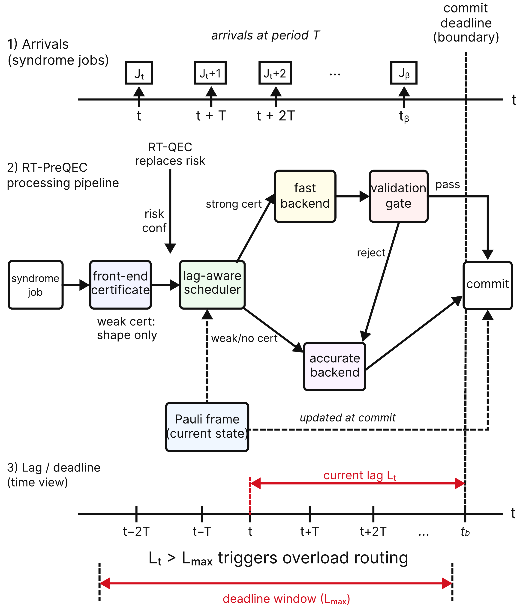
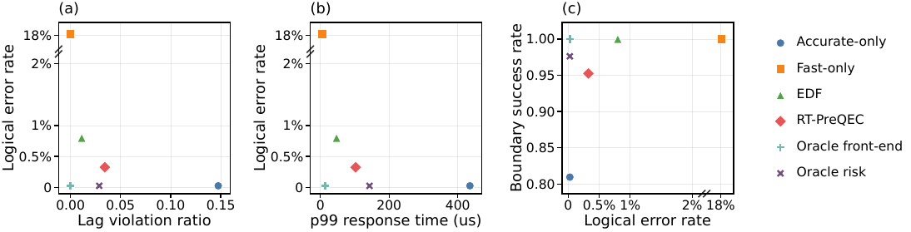
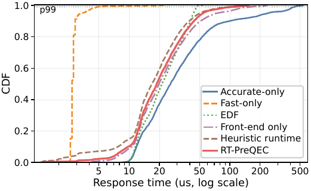
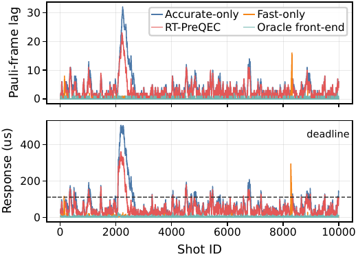
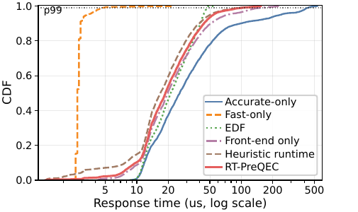
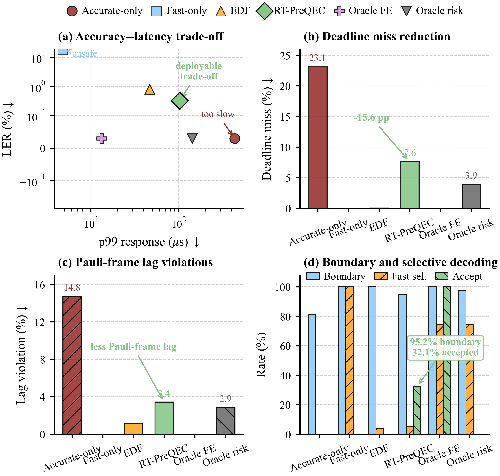
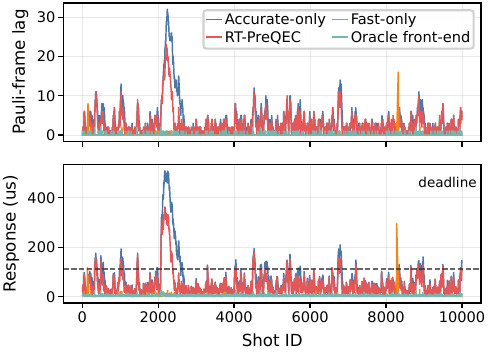
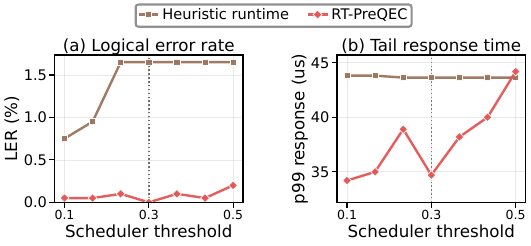
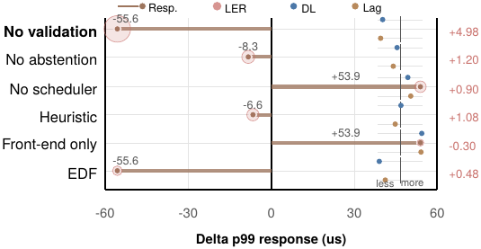

# RT-PreQEC — Reproduction Guide

This repository is the reproduction artifact for the RTSS 2026 submission
**“RT-PreQEC: Lag-Bounded Real-Time Scheduling for Quantum Error Correction.”**
It contains the runtime, the evaluation harness, every committed run input, the
published figures, and the data behind every figure and table in the paper.

> This README mirrors the **current** paper draft (Overleaf revision `58f61e6`):
> **ten figures** (`figure1.pdf`–`figure9.pdf` plus `t1.png`) and **three tables**
> (`tab:regimes`, `tab:modes`, `tab:overhead`). The original main-results and
> ablation-delta tables were replaced by two figures — `t1.png` (`fig:main`, §6)
> and `figure9.pdf` (`fig:ablation-delta`, §8) — both backed by committed CSVs.

> **TL;DR — the fastest path that works out of the box:**
>
> ```bash
> conda env create -f environment.yml && conda activate rt-preqec
> python -m pip install -e .[dev]
> python -m pytest tests -q                 # expect: 164 passed, 1 failed (known)
> python scripts/verify_paper_numbers.py    # expect: 364 checks reproduce, 0 deviate
> python scripts/make_rtss_plots.py --run-dir table/figure_data/d7_main \
>     --threshold-sweep table/figure_data/threshold_sweep/threshold_sweep.csv \
>     --burst-run-dir table/figure_data/burst --out results/figures/rerun
> python scripts/export_rtss_tables.py --run-dir table/figure_data/d7_main --out results/tables/rerun
> ```
>
> `verify_paper_numbers.py` checks every reported metric against the committed
> traces; the last two commands redraw the data behind **figures 5–8** and rebuild
> the CSVs behind **`t1.png` (fig:main) and figure 9**. Running the full pipeline
> against the same traces is covered in [§6](#6-re-running-the-full-pipeline-on-the-committed-traces)
> and takes roughly 30 minutes on a single core.

---

## Contents

1. [What this is](#1-what-this-is)
2. [Environment setup](#2-environment-setup)
3. [Verifying the install](#3-verifying-the-install)
4. [Repository layout](#4-repository-layout)
5. [Reproducing the paper's numbers](#5-reproducing-the-papers-numbers)
6. [Re-running the full pipeline on the committed traces](#6-re-running-the-full-pipeline-on-the-committed-traces)
7. [Reproducing the component-overhead table](#7-reproducing-the-component-overhead-table-taboverhead)
8. [Exporting the paper-ready figure PDFs](#8-exporting-the-paper-ready-figure-pdfs)
9. [Paper reference — figures and tables](#9-paper-reference--figures-and-tables)
10. [Name mapping and configuration reference](#10-name-mapping-and-configuration-reference)
11. [Reproducibility notes and known limitations](#11-reproducibility-notes-and-known-limitations)
12. [Citing](#12-citing)

---

## 1. What this is

RT-PreQEC is a **lag-bounded real-time scheduling runtime** for QEC decoding. A
continuous syndrome stream is dispatched across a heterogeneous pair of backends —
a fast lookup decoder and an accurate PyMatching (Sparse Blossom) decoder — under
deadline, backlog, and Pauli-frame-lag constraints. A local **front-end
certificate** shapes the workload and a **fast-path eligibility gate** withholds
fast commitment from higher-risk syndromes, while a learned **LSTM risk estimate**
guides the scheduler's routing.

The contribution is the real-time task model, the scheduler, and the evaluation —
not the predecoder, which is a known workload-shaping building block.

| Symbol | Meaning |
|---|---|
| **LER** | Logical error rate — primary safety metric (lower is better). |
| **p99 / p999 response** | Wall-clock response-time percentiles per job (µs). |
| **DL miss** | Deadline-miss ratio (fraction of jobs missing the regime decode deadline). |
| **Lag violation** | Fraction of jobs whose Pauli-frame lag exceeds $L_{\max}=4$ pending jobs. |
| **Boundary** | Boundary-commit success — fraction of boundary rounds decoded on time. |
| **Fast sel** | Fast-selection ratio — fraction of jobs routed to the fast backend. |
| **Accept** | Front-end accept rate — share of jobs the eligibility predicate admits. |

### The real-time QEC control loop (paper Figure 1, `fig:intro-loop`)

Each stabilizer round produces a syndrome that the classical control system must
decode fast enough to keep the Pauli frame current; a decoding backlog delays
corrections and degrades subsequent logical operations. RT-PreQEC is the
real-time layer in that loop.


### The lag-bounded task model (paper Figure 2, `fig:lag-model`)

Syndrome jobs are released every round period $T$; each has a deadline
$d_t = a_t + D$. The Pauli-frame lag $L_i$ accumulates while work is backlogged,
and breaching $L_{\max}$ triggers overload routing toward the boundary's hard
commit point.



### The RT-PreQEC architecture (paper Figure 3, `fig:architecture`)

Every job flows through the same safety contract. The front-end emits a *weak*
certificate (residual shaping only) or a *strong* one (eligible for fast commit);
the eligibility gate is a predicate over front-end features of the residual
syndrome, evaluated **before dispatch**, so a job that fails it is routed to the
accurate backend rather than decoded fast and re-decoded afterwards; and the
accurate backend is always the fallback. The Pauli frame is only updated at a
commit.



### Priority-signal composition (paper Figure 4, `fig:priority-composition`)

Four per-job signals — logical risk $r_t$, boundary urgency $b_t$, Pauli-frame
age $L_t$, and residual workload $w_t$ — feed the priority function that the
scheduler maximizes when routing each job.



---

## 2. Environment setup

The artifact is **CPU-first**; no GPU is needed. All reported results were produced
on **Windows 10, single thread, no CPU pinning** (Python 3.10). Linux/macOS work
identically for the logic, but absolute timing numbers shift with the machine.

**Requirements:** Python ≥ 3.10. The full stack is `numpy, scipy, pandas, pyyaml,
tqdm, typer, rich, matplotlib, scikit-learn, torch, stim, sinter, pymatching`
(plus `pytest, ruff, black, mypy` for development).

### Option A — Conda (recommended)

```bash
conda env create -f environment.yml
conda activate rt-preqec
```

### Option B — pip (into an existing Python ≥ 3.10)

```bash
python -m pip install -e .[dev]
```

### Option C — minimal, tables/figures only

To redraw figures and tables from the committed data (§5) you do **not** need
`torch`, `stim`, or `pymatching` — only `pandas`, `matplotlib`, and `typer`. Those
are only required for the *experiment* runs in §6.

> **Note.** `environment.yml` and `pyproject.toml` pin **no** dependency versions.
> The exact software set used for the published numbers is recorded in every run's
> `suite_manifest.json` (`software_versions`), and was: Python 3.10.20, numpy 2.2.6,
> pandas 2.3.3, torch 2.10.0, stim 1.16.0, pymatching 2.4.0, matplotlib 3.10.9.
> Timing-derived metrics in particular depend on these versions and on the CPU, so
> install these exact versions if you need the closest match.

---

## 3. Verifying the install

Run the test suite. It covers the continuous-stream simulator, the real-stream
evaluator, the risk profiler, the front-end, and the artifact generators.

```bash
python -m pytest tests -q
```

**Expected result: `164 passed, 1 failed`.** The single failure is
`tests/test_rtss_artifacts.py::test_export_rtss_tables_writes_expected_csvs` and is
**pre-existing and unrelated to the runtime**: its fixture supplies modes `rt_qec`
and `rt_qec_without_scheduler` but not `rt_qec_ai`, and the exporter (correctly)
returns early before writing the ablation-delta CSV when the `rt_qec_ai` baseline
is absent. Do not be alarmed by it.

A fast end-to-end smoke run (toy fallback path, works even without `stim` /
`pymatching`):

```bash
python scripts/generate_dataset.py  --config configs/data_surface_code.yaml --out data/processed/small_dataset.npz
python scripts/train_predecoder.py  --config configs/train_predecoder.yaml   --data data/processed/small_dataset.npz --out checkpoints/tiny_predecoder.pt
python scripts/evaluate_realtime.py --config configs/eval_realtime.yaml      --data data/processed/small_dataset.npz --checkpoint checkpoints/tiny_predecoder.pt --out results/runs/smoke_eval
```

(These three are also `make generate-small`, `make train-small`, `make eval-small`.)

---

## 4. Repository layout

```text
.
├── README.md                   ← you are here
├── environment.yml             # conda environment
├── pyproject.toml              # pip package + dev extras
├── Makefile                    # smoke-path shortcuts only (not the paper pipeline)
├── configs/                    # all experiment configs
│   ├── real_stream_eval_main.yaml              # main regime, d=7 (paper operating point)
│   ├── real_stream_eval_main_ai_selected.yaml  # d=7 + rt_qec_ai mode (used for fig:main)
│   ├── real_stream_eval_scaling.yaml           # scaling regime, d=11
│   ├── real_stream_eval_burst.yaml             # burst regime, d=7 single worker
│   ├── real_stream_eval_burst_2w.yaml          # burst regime, d=7 two workers
│   └── policies/runtime_guard_q95_d7.json      # pre-registered, hash-pinned runtime guard
├── src/rt_preqec/              # the runtime, schedulers, front-end, evaluators
├── scripts/                    # the reproduction entry points (see §5–§8)
├── figure/                     # the paper's ten figures as published (9 PDFs + t1.png)
├── table/                      # CSV data behind every paper figure and table
│   └── figure_data/            #   per-mode event traces that regenerate figures 5–8
├── checkpoints/                # committed trained models (LSTM risk profiler, predecoder)
├── data/processed/             # committed 300k-sample predecoder dataset
├── results/
│   ├── runs/                   # starts empty; the §6 commands repopulate it
│   ├── figures/                # published PNG figures (reference to diff a rerun against)
│   └── tables/                 # published table CSVs (reference to diff a rerun against)
├── docs/assets/                # PNG renderings of the paper figures (used by this README)
└── tests/                      # pytest suite (164 passed / 1 known failure)
```

Two directories live **outside** this repository, as siblings, and are *not* part of
the artifact:

```text
../paper/                LaTeX source, and paper/tools/export_rtss_paper_figures.py (§8)
../experiment_records/   archived run outputs and planning notes (authoritative archive)
```

### Committed inputs that let you skip long steps

The artifact is deliberately self-contained so the evaluation can be re-run without
retraining or rebuilding:

- `checkpoints/risk_lstm_v2_smoke_30.pt` — the learned LSTM risk profiler used by the
  paper's RT-PreQEC mode (`rt_qec_ai`), plus its `.features.json`, `.norm.json`, and
  `_calibration.json` sidecars. **Pass the checkpoint to every §6 command; leave the
  calibration sidecar out (see §6.0).**
- `checkpoints/predecoder_v1_300k.pt` and `data/processed/predecoder_dataset_v1_300k.npz`
  — the trained front-end predecoder and its dataset.
- `configs/policies/runtime_guard_q95_d7.json` — the runtime-guard margins, calibrated
  once on an exploratory split and hash-pinned so a confirmation run cannot retune them.

### The learned components in `src/rt_preqec/models/`

RT-PreQEC is not a full neural decoder. The learned paths are fallback-safe workload
shapers: they score scheduler risk or select one local DEM candidate, and every output can
be rejected by confidence/risk thresholds, validation, or backend fallback.

`RiskRuntimeModel` (`risk_runtime_model.py`) is the risk/runtime profiler the lag-aware
scheduler consumes. It maps `features_t` plus causal history through a feature-projection
encoder, a causal history encoder, and a fusion layer to four heads: `risk` (the fast
decoder may be wrong or unsafe for this job), `hard_runtime` (the accurate decoder may fall
into its runtime tail), `runtime_pred` (a `log1p(accurate_runtime_us)` service-time
estimate), and `confidence` (whether the scheduler should trust the output at all — not the
same thing as low risk). The paper's `rt_qec_ai` mode uses the LSTM temporal variant;
`none`/MLP is the non-temporal baseline, and GRU/TCN are alternatives. Three constraints
matter for reproduction:

- All temporal modes are causal and unidirectional. Bidirectional history would look into
  the future and is rejected.
- Temporal training must use the `stream_block` or `episode` split policy; `random` is
  allowed only for non-temporal ablations. `HistoryRiskDataset` pads at split starts and
  never reads history across a split boundary, so validation/test history cannot leak train
  features. Normalization is computed from train features only and stored in the checkpoint.
- The `hard_runtime` head trains only when dataset metadata marks
  `hard_runtime_label_valid=true`, which requires loop-per-shot decoder timing. Batch decode
  may be used for accuracy, but batch-average latency is not a valid per-shot tail target.

Risk and confidence thresholds are not model constants — they are selected on the validation
split by `scripts/calibrate_risk_thresholds.py` and loaded at test time (see §6.0).

`CandidatePredecoderModel` (`candidate_predecoder_model.py`) is the selective neural
predecoder: it encodes a detector patch and its DEM candidates, scores their compatibility,
and emits candidate logits plus abstain and confidence/risk outputs before validation
produces the residual syndrome. It ranks *bounded local DEM candidates* rather than
generating corrections, so every proposal is one that validation can check, and the explicit
abstain head lets the system fall back when a patch is ambiguous, high-risk,
observable-touching, or poorly covered by candidates.

---

## 5. Reproducing the paper's numbers

Every regime the paper reports ships as a committed trace under
`table/figure_data/`, so reproduction replays those traces rather than sampling new
syndromes. Start here — no experiment runs, and the numbers come out exactly.

### 5.0 One-command check

```bash
python scripts/verify_paper_numbers.py
```

This replays all four regimes through the queue simulator and diffs every metric
against the committed summaries at `rtol=1e-6`. Expected output:

```text
364 metric checks reproduce, 0 deviate (rtol=1e-06)
```

Add `--regime d11_scaling` to check one regime. The four available regimes are
`d7_main`, `d11_scaling`, `burst`, and `burst_2w`; each carries `records.csv`, a
`summary_metrics.csv`, and per-mode `events.csv` for all 13 modes.

### 5.1 Redraw the figures (PNG)

```bash
python scripts/make_rtss_plots.py \
    --run-dir          table/figure_data/d7_main \
    --threshold-sweep  table/figure_data/threshold_sweep/threshold_sweep.csv \
    --burst-run-dir    table/figure_data/burst \
    --out              results/figures/rerun
```

This writes 10 PNGs to `results/figures/rerun/`. The ones that correspond to paper
figures:

| Output PNG | Paper figure | Source data |
|---|---|---|
| `main_pareto_frontier.png` | **Figure 5** — main operating-point comparison (`fig:pareto`, §5) | `d7_main/summary_metrics.csv` |
| `response_time_cdf_by_mode.png` | **Figure 6** — response-time CDF (`fig:cdf`, §5) | `d7_main/<mode>/events.csv` |
| `burst_lag_backlog_trace.png` | **Figure 7** — burst lag & response (`fig:burst`, §7) | `burst/<mode>/events.csv` |
| `threshold_sweep_lag_frontier.png` | **Figure 8** — decoupled threshold sweep (`fig:sweep`, §7) | `threshold_sweep/threshold_sweep.csv` |

(`logical_error_rate_vs_pauli_frame_lag_violation.png`,
`logical_error_rate_vs_p99_response_time.png`, and
`boundary_commit_success_vs_logical_error.png` are the single-panel variants of
figure 5's three panels; `lag_model_task_flow.png` and `rt_qec_architecture.png` are
rough generator schematics, distinct from the hand-polished figures 1–4 in the paper.)

### 5.2 Rebuild the table CSVs

```bash
python scripts/export_rtss_tables.py \
    --run-dir table/figure_data/d7_main \
    --out     results/tables/rerun
```

This writes five CSVs (compare them to `table/`). None of them appears as a LaTeX
table in the current draft — the paper's former main/ablation tables are now
**figures** — but two of them are exactly what those figures plot:

| Output CSV | Backs |
|---|---|
| `rtss_main_table.csv` | **`t1.png`** — the main-results figure (`fig:main`, §6) |
| `rtss_ablation_delta_vs_rt_qec.csv` | **Figure 9** — ablation impact vs. RT-PreQEC (`fig:ablation-delta`, §8) |
| `rtss_main_ablation_table.csv` | `t1.png` superset incl. all 8 ablation modes |
| `rtss_safety_contract_table.csv` | safety-contract comparison (prose support) |
| `rtss_ai_risk_table.csv` | learned- vs heuristic-risk comparison (prose support) |

> **Verified on the reference machine.** The five CSVs from §5.2 come out
> **byte-identical** to `table/rtss_*.csv`. For the figures, the publisher script
> (§8) reproduces the submission's main-comparison and threshold-sweep PDFs
> **byte-for-byte**; the CDF and burst-trace PDFs differ only by a sub-point canvas
> width introduced by a newer matplotlib, not by the data.

**`tab:overhead`** (component overheads) is *not* produced here — it is a
microbenchmark, not a trace product. See
[§7](#7-reproducing-the-component-overhead-table-taboverhead). The paper's other
two tables — `tab:regimes` (§3) and `tab:modes` (§5) — are hand-written
configuration tables with no computed data behind them (§9).

### 5.3 Supporting and multi-regime tables

```bash
# regime summary (d7 / d11 / burst) and the front-end contract table
python scripts/summarize_rtss_results.py \
    --d7    table/figure_data/d7_main/summary_metrics.csv \
    --d11   table/figure_data/d11_scaling/summary_metrics.csv \
    --burst table/figure_data/burst/summary_metrics.csv \
    --out-dir results/tables/rerun

# 1-worker vs 2-worker burst capacity table
python scripts/export_rtss_tables.py \
    --run-dir            table/figure_data/d7_main \
    --burst-1w-run-dir   table/figure_data/burst \
    --burst-2w-run-dir   table/figure_data/burst_2w \
    --out                results/tables/rerun
```

These reproduce every metric in `table/regime_summary_table.csv` and
`table/frontend_contract_table.csv` (the committed copies carry the older
`Accurate`/`Fast`/`Pre-Dec` labels in `display_mode`; the numbers are identical), plus
`table/rtss_burst_capacity_table.csv`.

---

## 6. Re-running the full pipeline on the committed traces

§5 replays the traces through the queue simulator. This section runs the **whole
pipeline** — front-end, risk model, routing, queueing, metrics — against those same
traces, which is the strongest reproduction available: it exercises every stage of the
runtime and still lands on the published numbers.

### 6.0 The one primitive every experiment uses

`scripts/run_paper_experiment_suite.py` is the single entry point. One invocation runs
**one regime** end-to-end: it loads the trace named by `--records`, evaluates every
mode **on the same shots** (the paired-shot protocol), and writes the outputs. The four
regimes are four invocations differing only in `--config` and `--records`.

All §6 commands pass the committed learned-risk checkpoint so that the RT-PreQEC mode
(`rt_qec_ai`) is exercised:

```text
--risk-checkpoint checkpoints/risk_lstm_v2_smoke_30.pt
```

> Do **not** add `--calibration` to these commands. The published runs took their
> routing thresholds from the config, and passing the calibration sidecar overrides the
> scheduler risk threshold (to 0.25), which reroutes a few hundred borderline jobs and
> shifts the reported metrics.

### 6.1 Main regime (d = 7) — produces the data behind Figures 5 & 6, `t1.png`, and Figure 9

```bash
python scripts/run_paper_experiment_suite.py \
    --config          configs/real_stream_eval_main_ai_selected.yaml \
    --records         table/figure_data/d7_main/records.csv \
    --split           test \
    --risk-checkpoint checkpoints/risk_lstm_v2_smoke_30.pt \
    --include-ai \
    --no-threshold-sweep \
    --out             results/runs/paper_suite_d7_rtqec_ai_selected
```

**~1–2 minutes** (73 s measured). Key outputs under
`results/runs/paper_suite_d7_rtqec_ai_selected/`:

```text
main/summary_metrics.csv        ← the 13-mode table → Figure 5, t1.png, Figure 9
main/<mode>/events.csv          ← per-job traces    → Figure 6 (CDF)
main/records.csv                ← the shared 4 000-shot batch + per-shot records
main/metrics.json               ← eval protocol + flags (real_qec, timing_mode, …)
suite_manifest.json             ← seeds, software_versions, git commit hash
```

`main/summary_metrics.csv` matches `table/figure_data/d7_main/summary_metrics.csv` on
every metric.

### 6.2 Scaling regime (d = 11)

```bash
python scripts/run_paper_experiment_suite.py \
    --config  configs/real_stream_eval_scaling.yaml \
    --records table/figure_data/d11_scaling/records.csv \
    --split   test \
    --risk-checkpoint checkpoints/risk_lstm_v2_smoke_30.pt \
    --include-ai --no-threshold-sweep \
    --out     results/runs/paper_suite_d11_rtqec_ai
```

**~10 minutes** (570 s measured; PyMatching at d=11 is much slower). Feeds the d=11
rows of `regime_summary_table.csv` and the §6 scaling discussion.

### 6.3 Burst regime (d = 7, p = 0.005, overload) — produces Figure 7

```bash
python scripts/run_paper_experiment_suite.py \
    --config  configs/real_stream_eval_burst.yaml \
    --records table/figure_data/burst/records.csv \
    --split   test \
    --risk-checkpoint checkpoints/risk_lstm_v2_smoke_30.pt \
    --include-ai --no-threshold-sweep \
    --out     results/runs/paper_suite_burst_rtqec_ai
```

**~1.5 minutes** (78 s). `main/<mode>/events.csv` feeds Figure 7. For the two-worker
sensitivity point, rerun with `configs/real_stream_eval_burst_2w.yaml`,
`--records table/figure_data/burst_2w/records.csv`, and
`--out results/runs/paper_suite_burst_2w_rtqec_ai`, then build the capacity table as
in §5.3.

### 6.4 Decoupled threshold sweep — produces Figure 8

The paper's Figure 8 decouples the *predecode* shaping threshold from the *scheduler*
fast-commit threshold. Run it by enabling the sweep on the main d=7 config and
narrowing the predecode/confidence grids to the selected point:

```bash
python scripts/run_paper_experiment_suite.py \
    --config          configs/real_stream_eval_main_ai_selected.yaml \
    --split           test \
    --threshold-split val \
    --risk-checkpoint checkpoints/risk_lstm_v2_smoke_30.pt \
    --include-ai \
    --threshold-sweep \
    --predecode-risk-thresholds 0.35 \
    --confidence-thresholds     0.50 \
    --out             results/runs/paper_suite_d7_rtqec_ai_decoupled
```

**~9 minutes** (546 s). Writes `threshold_sweep.csv` at the run root — the Figure 8
source — plus 14 per-point directories under `threshold_sweep/` named
`<mode>_pre_<p>_sched_<s>_conf_<c>` (2 modes × 7 scheduler thresholds 0.10–0.50).

> Unlike §6.1–§6.3, this command cannot be pinned with `--records`: the sweep runs on
> the **validation** split (2 000 shots) while the committed traces are the test split
> (4 000 shots). The published grid lives at
> `table/figure_data/threshold_sweep/threshold_sweep.csv` and is what Figure 8 plots.

> Do **not** use `scripts/evaluate_threshold_sweep.py` for Figure 8 — that older
> script *couples* the two thresholds into one knob, whereas the paper's sweep is
> decoupled and is produced only by the suite command above.

### 6.5 What each run writes

Every suite invocation produces this layout under its `--out` directory:

```text
<out>/
├── main/                            # the single-regime evaluation over all modes
│   ├── records.csv                  # the shared syndrome batch + per-shot records
│   ├── summary_metrics.csv          # per-mode aggregate metrics  → Figure 5, t1.png, Figure 9
│   ├── frontend_contract_table.csv  # front-end accept / abstain / false-accept
│   ├── setting_summary.csv          # per-setting / per-noise breakdown
│   ├── metrics.json                 # eval protocol, split hashes, real_qec flag
│   ├── plot_events.csv              # plot-ready event table
│   ├── pareto_summary.csv
│   ├── predictions.npz
│   └── <mode>/                      # one dir per mode
│       ├── events.csv               # per-job trace  → Figures 6, 7
│       ├── decisions.csv
│       └── predictions.csv
├── suite_manifest.json              # config, seeds, software versions, git hash
├── threshold_sweep.csv              # (only with --threshold-sweep) → Figure 8
└── threshold_sweep/<mode>_pre_.._sched_.._conf_../   # one dir per sweep point
```

---

## 7. Reproducing the component-overhead table (`tab:overhead`)

The paper's only computed table is an isolated microbenchmark of each runtime
component, **not** a trace product. The published numbers used **2 000 shots with
100 warm-up** (1 900 measured), single thread, Windows 10, no CPU pinning:

```bash
python scripts/measure_rtss_overheads.py \
    --config       configs/real_stream_eval_main.yaml \
    --num-shots    2000 \
    --warmup-shots 100 \
    --out          results/runs/wcet_overheads_d7
```

**~16 s.** Writes:

```text
results/runs/wcet_overheads_d7/
├── overhead_summary.csv       ← == tab:overhead  (committed copy: table/rtss_overhead_table.csv)
├── overhead_trace.csv         ← per-shot raw timing trace
└── measurement_protocol.json  ← shot counts, platform, timing mode (== table/rtss_overhead_measurement_protocol.json)
```

**Verified:** the means reproduce closely (scheduler 1.47 µs vs 1.19 µs published;
accurate backend 8.66 µs vs 8.85 µs). The tails move with the machine, which is
expected for an empirical microbenchmark — the paper reports these as empirical
timing, not formal WCET bounds.

---

## 8. Exporting the paper-ready figure PDFs

The PNGs from §5 are convenient for inspection; the **PDFs** the paper includes are
produced by a separate exporter that lives with the paper source (not in this repo):

```text
../paper/tools/export_rtss_paper_figures.py
```

Run it from the **paper** repository root, with this repo on the path:

```bash
cd ../paper
PYTHONPATH=../code:../code/src python tools/export_rtss_paper_figures.py \
    --run-dir          ../code/results/runs/paper_suite_d7_rtqec_ai_selected/main \
    --burst-run-dir    ../code/results/runs/paper_suite_burst_rtqec_ai/main \
    --threshold-sweep  ../code/results/runs/paper_suite_d7_rtqec_ai_decoupled/threshold_sweep.csv \
    --out              RTSS/6a131841608c92582d0fcb7c/figure
```

> **Numbering caveat.** The exporter predates the current draft: it writes the four
> data figures under the *old* submission numbering — `figure3.pdf` (pareto),
> `figure4.pdf` (CDF), `figure5.pdf` (burst), `figure6.pdf` (sweep). In the current
> paper those same plots are **`figure5.pdf`, `figure6.pdf`, `figure7.pdf`, and
> `figure8.pdf`** respectively, so rename when copying into the paper's `figure/`
> directory. By default the exporter passes `--skip-diagrams`: the four schematics
> (**figures 1–4** in the current draft) were redrawn by hand, so the exporter
> leaves them alone unless you pass `--include-diagrams`. The two newest data
> figures — **`t1.png`** (fig:main) and **`figure9.pdf`** (fig:ablation-delta) —
> have no committed plotting script; they were rendered from
> `table/rtss_main_table.csv` and `table/rtss_ablation_delta_vs_rt_qec.csv`, which
> §5.2 regenerates byte-identically (see §9).

To point it at the committed data instead of a fresh run, substitute
`--run-dir ../code/table/figure_data/d7_main`, `--burst-run-dir
../code/table/figure_data/burst`, and `--threshold-sweep
../code/table/figure_data/threshold_sweep/threshold_sweep.csv` — that is exactly how
the submission's figures were produced.

---

## 9. Paper reference — figures and tables

These are the artifacts as published (Overleaf revision `58f61e6`). Each data figure
is reproducible from `table/figure_data/` (§5) or re-runnable from scratch (§6). The
PNGs shown below live in `docs/assets/` (rendered from `figure/*.pdf` with
`pdftoppm -png -r 150`).

### Figure 5 — Main operating-point comparison (`fig:pareto`, d = 7, §5)

Logical error rate against lag violation, p99 response, and boundary-commit success.
RT-PreQEC sits between the accurate-only and fast-only endpoints: far lower LER than
the timing-first baselines, much lower tail latency than accurate-only. Oracle modes
are non-deployable upper bounds.



- **Script:** `make_rtss_plots.py` → `main_pareto_frontier.png` (§5.1); PDF via §8.
- **Data:** `table/figure_data/d7_main/summary_metrics.csv`.
- **Re-run:** §6.1.

### Figure 6 — Response-time CDF (`fig:cdf`, d = 7, §5)

Per-job response-time CDF. The timing gain comes from selectively removing
high-latency accurate decodes from the tail rather than uniformly accelerating all
jobs.



- **Script:** `make_rtss_plots.py` → `response_time_cdf_by_mode.png` (§5.1); PDF via §8.
- **Data:** `table/figure_data/d7_main/<mode>/events.csv`.
- **Re-run:** §6.1.

### `t1.png` — Main results (`fig:main`, d = 7, §6)

The paper's headline results are a **figure**, not a table: four panels over the
evaluated configurations — logical error rate, deadline misses, Pauli-frame lag, and
boundary commit with front-end accept. The underlying values are exactly
`table/rtss_main_table.csv` (produced byte-identically by §5.2).



| Mode | LER (%) | p99 Resp (µs) | DL Miss (%) | p99 Lag | Lag Viol (%) | Boundary (%) | Fast Sel (%) | Accept (%) |
|---|---:|---:|---:|---:|---:|---:|---:|---:|
| Accurate-only    | 0.03  | 435.4 | 23.15 | 28 | 14.75 | 81.0  | 0.00  | 0.0   |
| Fast-only        | 18.15 | 4.8   | 0.00  | 0  | 0.00  | 100.0 | 100.00 | 0.0  |
| EDF              | 0.80  | 46.8  | 0.05  | 5  | 1.13  | 100.0 | 4.23  | 0.0   |
| **RT-PreQEC**    | 0.33  | 102.4 | 7.60  | 8  | 3.43  | 95.2  | 5.20  | 32.1  |
| Oracle front-end | 0.03  | 13.2  | 0.00  | 1  | 0.00  | 100.0 | 74.55 | 100.0 |
| Oracle risk      | 0.03  | 142.9 | 3.90  | 10 | 2.88  | 97.6  | 74.55 | 0.0   |

- **Data:** `table/rtss_main_table.csv` ← `table/figure_data/d7_main/summary_metrics.csv` (§5.2).
- **Re-run:** §6.1. The published `t1.png` rendering itself has no committed plotting
  script — the CSV is the source of truth.

### Figure 7 — Burst regime: lag and response over time (`fig:burst`, §7)

Pauli-frame lag and response time through the burst overload window. The dashed line
is the burst deadline; the oracle front-end quantifies the headroom.



- **Script:** `make_rtss_plots.py` → `burst_lag_backlog_trace.png` (§5.1); PDF via §8.
- **Data:** `table/figure_data/burst/<mode>/events.csv`.
- **Re-run:** §6.3.

### Figure 8 — Decoupled threshold sweep (`fig:sweep`, d = 7 validation split, §7)

Sweeping the scheduler risk threshold with the predecode shaping threshold fixed at
0.35. The two thresholds are separate knobs; the learned-risk RT-PreQEC is the safer
operating point. The dotted vertical line marks the selected threshold 0.30.



- **Script:** `make_rtss_plots.py` → `threshold_sweep_lag_frontier.png` (§5.1); PDF via §8.
- **Data:** `table/figure_data/threshold_sweep/threshold_sweep.csv`.
- **Re-run:** §6.4.

### Figure 9 — Ablation impact vs. RT-PreQEC (`fig:ablation-delta`, §8)

Per-ablation deltas relative to RT-PreQEC at the selected d=7 operating point.
Positive ΔLER means higher error; negative ΔDL Miss means fewer misses. The
underlying values are exactly `table/rtss_ablation_delta_vs_rt_qec.csv` (produced
byte-identically by §5.2).



| Ablation | ΔLER (pp) | ΔDL Miss (pp) | ΔLag Viol (pp) |
|---|---:|---:|---:|
| No validation (A1)  | +4.98 | −6.65 | −3.03 |
| No abstention (A2)  | +1.20 | −2.78 | −1.05 |
| No scheduler (A3)   | +0.90 | +0.10 | +1.68 |
| Heuristic certified | +1.08 | −1.75 | −0.75 |
| Front-end only      | −0.30 | +3.83 | +3.28 |
| EDF baseline        | +0.48 | −7.55 | −2.30 |

- **Data:** `table/rtss_ablation_delta_vs_rt_qec.csv` ← `table/figure_data/d7_main/summary_metrics.csv` (§5.2).
- **Re-run:** §6.1. Like `t1.png`, the published rendering has no committed plotting
  script — the CSV is the source of truth.

### `tab:overhead` — Per-component overhead (§7)

Isolated microbenchmark, 1 900 measured shots, single thread, Windows 10, no pinning.

| Component | Mean (µs) | p99 (µs) | Max (µs) |
|---|---:|---:|---:|
| Scheduler        | 1.19  | 3.9   | 28.1  |
| Validation       | 16.3  | 38.5  | 189.9 |
| Front-end        | 53.6  | 176.9 | 294.2 |
| Fast backend     | 1.99  | 2.9   | —     |
| Accurate backend | 8.85  | 19.2  | —     |

- **Script:** `measure_rtss_overheads.py` → `overhead_summary.csv` (§7).
- **Committed copy:** `table/rtss_overhead_table.csv` · protocol in
  `table/rtss_overhead_measurement_protocol.json`.

### `tab:regimes` and `tab:modes` — hand-written tables (§3, §5)

The paper's remaining two tables have **no computed data behind them**; they
declare the evaluation setup:

- **`tab:regimes` (§3) — Evaluation regimes.** Main: d=7, 7 rounds, T=6 µs,
  deadline 48 µs, primary Pareto. Scaling: d=11, 11 rounds, T=10 µs, deadline
  40 µs, scheduler value. Burst: d=7, 7 rounds, T=7 µs, deadline 28 µs, overload
  stress. These parameters are exactly the configs listed in §10.2; the measured
  per-regime metrics live in `regime_summary_table.csv` below.
- **`tab:modes` (§5) — Evaluated configurations and their roles.** The 11 named
  configurations (endpoints, baselines, ablations, oracles) — mapped to
  implementation mode keys in §10.1.

### Multi-regime summary (`regime_summary_table.csv`, §6 discussion)

Not a paper table — the measured numbers behind the §6 scaling and burst
discussion:

| Regime | Mode | LER (%) | p99 Resp (µs) | Lag Viol (%) | Boundary (%) | Fast Sel (%) |
|---|---|---:|---:|---:|---:|---:|
| **d=7**   | Accurate-only | 0.03  | 435.4   | 14.75 | 81.0  | 0.00  |
|           | Fast-only     | 18.15 | 4.8     | 0.00  | 100.0 | 100.0 |
|           | EDF           | 0.80  | 46.8    | 1.13  | 100.0 | 4.23  |
|           | Heuristic certified | 1.40 | 95.8   | 2.68  | 97.6  | 16.75 |
|           | **RT-PreQEC** | 0.33  | 102.4   | 3.43  | 95.2  | 5.20  |
| **d=11**  | Accurate-only | 0.00  | 11 781.9 | 78.43 | 4.8  | 0.00  |
|           | Fast-only     | 33.03 | 14.6    | 0.48  | 100.0 | 100.0 |
|           | EDF           | 10.80 | 39.6    | 0.00  | 100.0 | 32.05 |
|           | Heuristic certified | 5.73 | 4 570.3 | 44.58 | 28.6 | 19.45 |
|           | **RT-PreQEC** | 4.43  | 4 576.0 | 47.05 | 21.4  | 14.53 |
| **burst** | Accurate-only | 0.28  | 471.7   | 24.45 | 28.6  | 0.00  |
|           | Fast-only     | 24.93 | 22.1    | 0.55  | 97.6  | 100.0 |
|           | EDF           | 5.65  | 27.9    | 0.38  | 97.6  | 19.93 |
|           | Heuristic certified | 0.70 | 313.3  | 16.33 | 42.9  | 3.45  |
|           | **RT-PreQEC** | 0.55  | 313.3   | 16.33 | 42.9  | 1.75  |

- **Script:** `summarize_rtss_results.py` (§5.3) · **Re-run:** §6.1–§6.3.
- *Note:* this CSV's `display_mode` column uses older internal labels
  (`RT-QEC`/`Pre-Dec`); the paper-facing names above are the correct ones (see §10).

---

## 10. Name mapping and configuration reference

### 10.1 Paper name ↔ implementation mode key

The paper uses descriptive names; the code uses mode keys. This mapping is
authoritative (`scripts/export_rtss_tables.py:MODE_LABELS`):

| Paper name | Mode key | Role |
|---|---|---|
| Accurate-only | `accurate_only` | endpoint |
| Fast-only | `fast_only` | endpoint |
| EDF | `edf` | timing-first baseline |
| **RT-PreQEC** | **`rt_qec_ai`** | main method (learned risk) |
| Heuristic certified | **`rt_qec`** | ablation (rule-based risk) |
| Front-end only | `heuristic_pre_fixed` | ablation |
| Rule risk | `risk_heuristic` | ablation |
| Learned risk only | `ai_risk` | ablation |
| No validation (A1) | `rt_qec_without_validation` | ablation |
| No abstention (A2) | `rt_qec_without_abstention` | ablation |
| No scheduler (A3) | `rt_qec_without_scheduler` | ablation |
| Oracle front-end | `oracle_predecoder` | upper bound (not deployable) |
| Oracle risk | `oracle_risk` | upper bound (not deployable) |

Two mappings are genuinely non-obvious and worth memorizing:

- The paper's **RT-PreQEC** row is mode **`rt_qec_ai`** (learned risk).
- The paper's **"Heuristic certified"** ablation row is mode **`rt_qec`** (heuristic risk).

The `--include-ai` flag is what inserts `ai_risk` and `rt_qec_ai` into the run's mode
list; without it you get 11 modes and **no RT-PreQEC row** in the tables.

### 10.2 Regime configurations

The three regimes are three config files. Shared: rotated surface code, memory-X,
10 000 shots, test fraction 0.4, max Pauli-frame lag 4, train seed 42, eval seed
1001, scheduler weights α=1.0 / β=1.2 / γ=0.5 / δ=2.0, boundary drain 2.

| Regime | Config | d | rounds | p | period (µs) | deadline (µs) | workers |
|---|---|---:|---:|---:|---:|---:|---:|
| Main | `real_stream_eval_main.yaml` (+ `_ai_selected`) | 7 | 7 | 0.003 | 6 | 48 | 1 |
| Scaling | `real_stream_eval_scaling.yaml` | 11 | 11 | 0.003 | 10 | 40 | 1 |
| Burst | `real_stream_eval_burst.yaml` / `_2w` | 7 | 7 | 0.005 | 7 | 28 | 1 / 2 |

### 10.3 Selected d = 7 operating point

Per `configs/real_stream_eval_main_ai_selected.yaml` (the config behind the main
results): front-end confidence threshold **0.50**, predecoder risk threshold
**0.35**, scheduler risk threshold **0.30**, max cluster size **6**. The predecode
and scheduler thresholds are deliberately decoupled — more jobs may receive residual
pruning, but only strongly certified low-risk jobs may commit through the fast
backend.

---

## 11. Reproducibility notes and known limitations

- **Reproduction replays the committed traces.** `table/figure_data/` carries one
  trace per regime (`records.csv`, plus `summary_metrics.csv` and per-mode
  `events.csv` for all 13 modes). §5 replays them through the queue simulator; §6
  runs the full pipeline against them via `--records`. Both land on the published
  numbers: `scripts/verify_paper_numbers.py` reports **364 metric checks reproduce,
  0 deviate** at `rtol=1e-6`, and `scripts/export_rtss_tables.py` returns the five
  `table/rtss_*.csv` files **byte-identical**.
- **Do not pass `--calibration` to the §6 commands.** The published runs read their
  routing thresholds from the config; the calibration sidecar overrides the scheduler
  risk threshold to 0.25, which reroutes borderline jobs and shifts the metrics.
- **Software versions are recorded, not pinned.** Each run writes
  `software_versions` into `suite_manifest.json`. The published set was Python
  3.10.20 / numpy 2.2.6 / pandas 2.3.3 / torch 2.10.0 / stim 1.16.0 / pymatching
  2.4.0 / matplotlib 3.10.9. The CDF and burst PDFs differ from the submission only
  by a sub-point canvas width from a newer matplotlib — the data is identical.
- **Component overheads are empirical timing, not WCET.** They move with CPU and
  load; `tab:overhead` reports the reference-machine microbenchmark, so its tails
  shift between machines while the trace-derived metrics do not.
- **Paired-shot protocol.** Within one run, all modes decode the *same* shots, so
  differences between modes reflect routing and scheduling rather than noise
  realization.
- **Figure 8 is not trace-pinned.** The threshold sweep runs on the validation split,
  which is not among the committed traces; see the note in §6.4.
- **Known test failure.** `pytest tests` → `164 passed, 1 failed`; the failure is a
  stale fixture in the table-exporter test, unrelated to the runtime (see §3).
- **Fallback path.** If `stim`, `sinter`, or `pymatching` is unavailable, the harness
  runs a toy fallback and records `real_qec=false` + `fallback_reason` in
  `metrics.json`. Check that flag: `real_qec=true` is required for any paper claim.

---

## 12. Citing

If you use this artifact, please cite the RTSS 2026 submission. The evaluation
framework, scheduler, front-end, and validation logic are implemented in Python on
top of Stim (circuit generation), PyMatching v2 / Sparse Blossom (accurate backend),
and a lookup-table fast backend.

```text
Artifact: RT-PreQEC reproduction repository
Commit used for all reported results: f211f182
```
